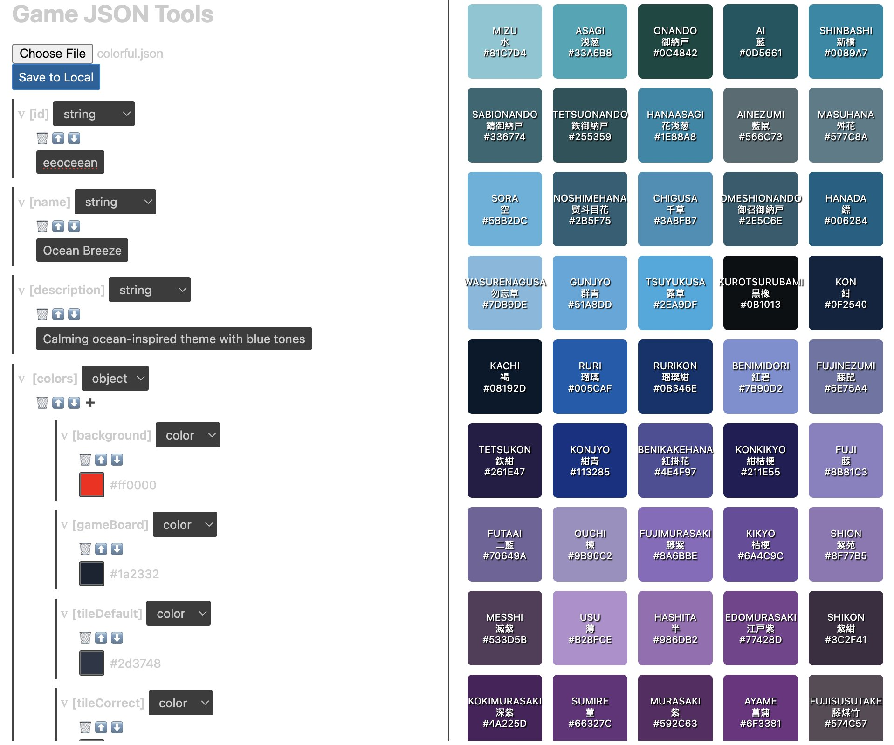

# Generic JSON Tools

This is a simple web application that allows you to configure JSON files with color palette suggestions from an image.

# Vibe Developed using Gemini-flash-2.5 with reference to

to The JSON editor https://github.com/slaugaus/visual-json-editor-vscode



## How to run the application

1.  Navigate to the `web-app` directory:
    ```bash
    cd web-app
    ```
2.  Install the dependencies:
    ```bash
    npm install
    ```
3.  Start the development server:
    ```bash
    npm start
    ```

The application will be available at `http://localhost:3002`.

## Features

- Load and edit JSON templates.
- Use a color picker to change color values.
- Generate a color palette from an image.
- Generate random colors.
- Browse a pre-selected list of colors from nipponcolors.com.
- Save the modified JSON to a local file.

# TODO

- in the json editor: string value should be inline-editable.
- in the json editor: numeric alue should be inline-editable with stepper for integerr, slider for float (step:0.1 can go +50,-50 of original value)
  numeric value can change directly from the text input beside the control.

- add json syntax highlight
- make the nipponcolors color set complete,if there are so many, add category option input to allow user selection
